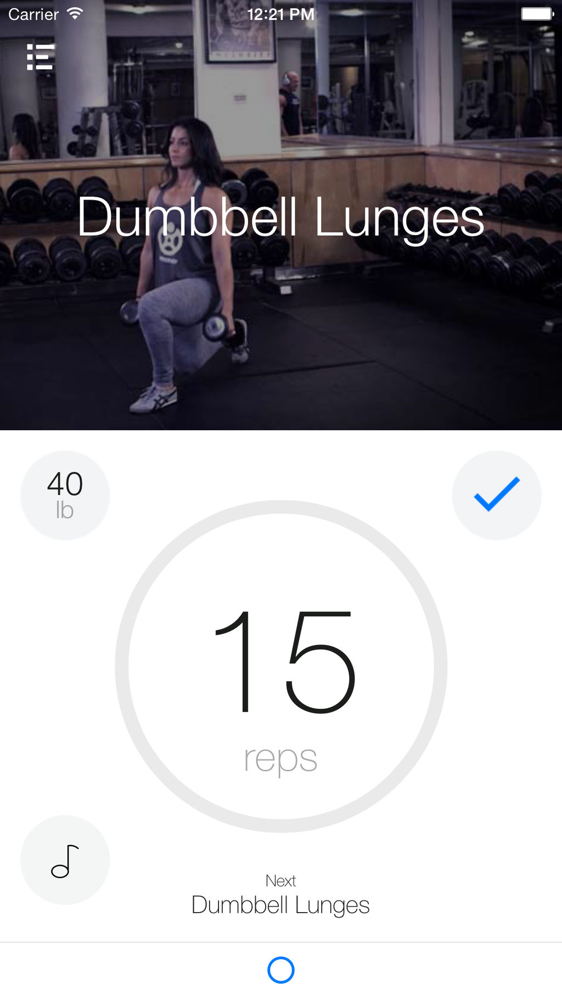
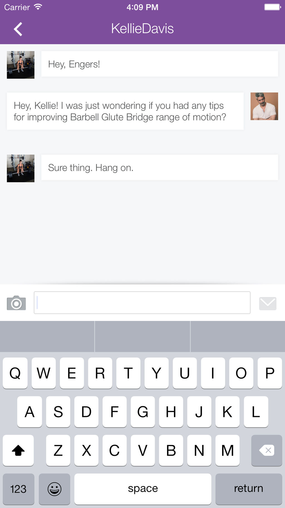
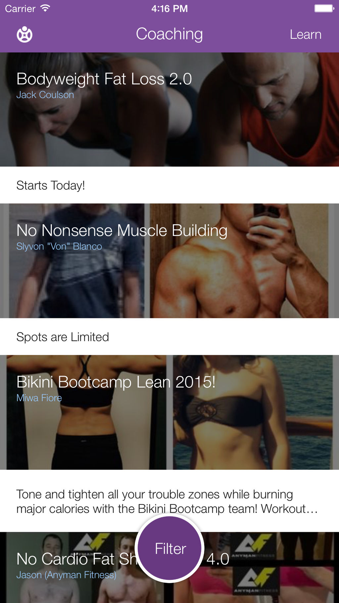
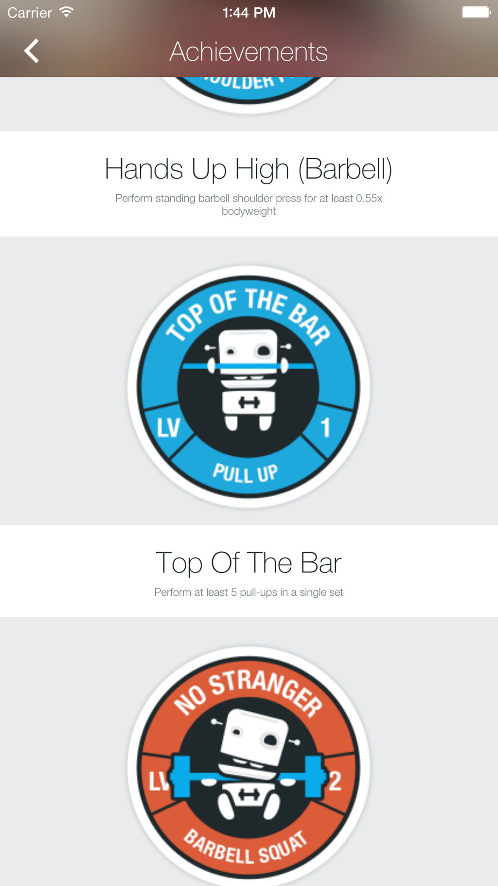
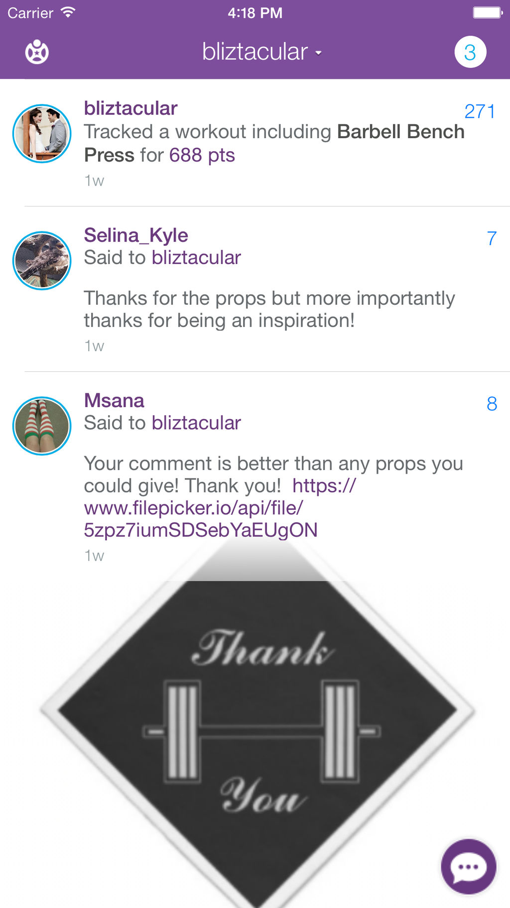
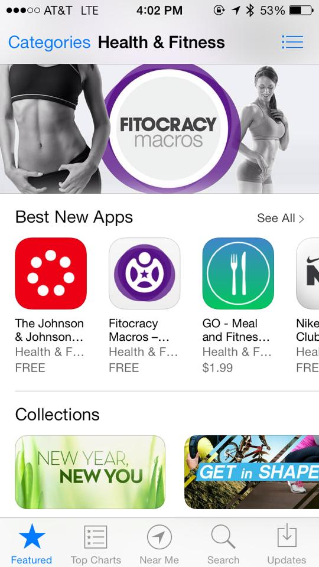
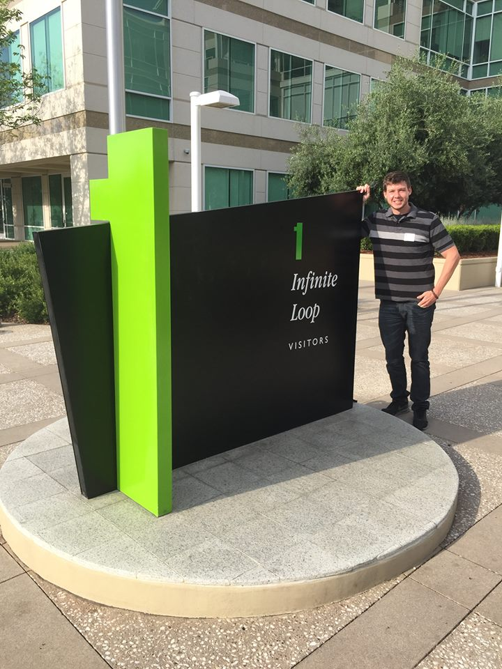
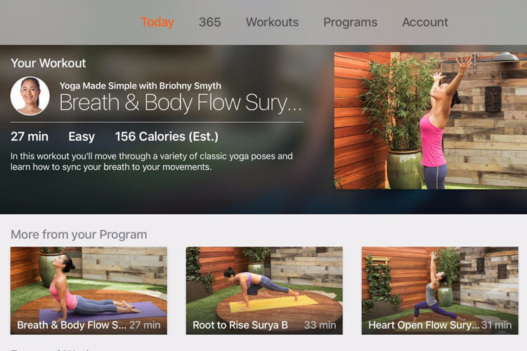
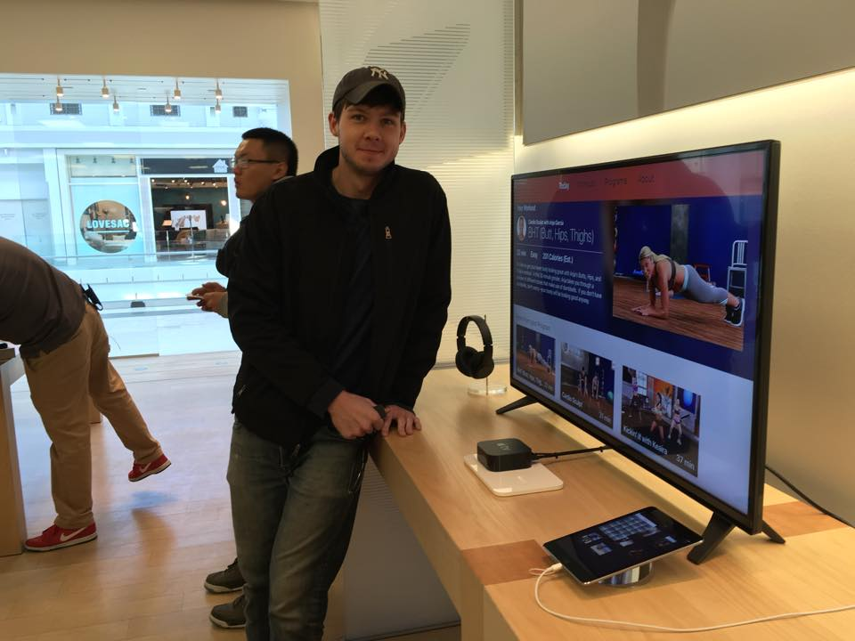

<!-- Main -->

  <!-- One -->

  <section id="one">
    

      <header class="major">
        <h2>Past Mobile App Work (iOS & Android)</h2>
      </header>
      

        I've been building apps since 2008 and have a lot of experience on
        multiple platforms and with multiple frameworks.
        <strong>If you can dream it, I can build it.</strong> Some of the
        projects I've worked on in the past are protected by NDAs. Below are
        some high profile ones that aren't. Check them out.
      

    

  </section>

  <!-- Two -->
  <section id="two" class="spotlights">
    <section>
      

        

          

            
          

          

            
          

          

            
          

          

            
          

          

            
          

          

            
          

        

      

      

        

          <header class="major">
            <h3>Fitocracy</h3>
          </header>
          

            Fitocracy is a fitness social network application that had a full
            suite of features like feeds, profiles, groups, chatting, workout
            tracking, and more. I was responsible for building the entire iOS
            app. Over 3 years, I architected the large application in order to
            make fast-paced changes as the company pivoted its strategies while
            maintaining the ability to delight our users with fun and
            interesting animations and interactions.
          

          
The company was acquired in 2016.

          <ul class="actions">
            <li>
              <a href="https://www.fitocracy.com/" class="button"
                >Fitocracy's Website</a
              >
            </li>
          </ul>
        

      

    </section>
    <section>
      

        

          

            
          

          

            
          

          

            
          

        

      

      

        

          <header class="major">
            <h3>Daily Burn</h3>
          </header>
          

            Daily Burn is another fitness application (there's certainly a theme
            here -- I care about health & fitness and like working on related
            applications). It is focused on video workout content with an on
            demand model. Think Netflix for video workouts you can do at home.
            They also launched a live streaming, daily morning workout while I
            was working with them.
          

          

            I built their Apple TV app prior to the launch of the test latest
            Apple TV. Apple had asked them to be a launch partner for the new
            devices and Daily Burn asked me to build that app. I spent 2 weeks
            in Cupertino and 2 weeks in New York working closely with their
            designer to get the app ready for launch. Then I got to see it live
            on the demo devices in my local Apple Store. Pretty damn cool.
          

          <ul class="actions">
            <li><a href="https://dailyburn.com" class="button">Daily Burn's Website</a></li>
          </ul>
        

      

    </section>
    <!-- <section>
      
      

        

          <header class="major">
            <h3>CharlieApp</h3>
          </header>
          

            Nullam et orci eu lorem consequat tincidunt vivamus et sagittis
            magna sed nunc rhoncus condimentum sem. In efficitur ligula tate
            urna. Maecenas massa sed magna lacinia magna pellentesque lorem
            ipsum dolor. Nullam et orci eu lorem consequat tincidunt. Vivamus et
            sagittis tempus.
          

          <ul class="actions">
            <li><a href="about" class="button">Learn more</a></li>
          </ul>
        

      

    </section> -->
  </section>

  <!-- Three -->
  <section id="three">
    

      <header class="major">
        <h2>Need an API?</h2>
      </header>
      

        Most apps can't do that much without a backend service that exposes an
        API. I build those too.
      

      <ul class="actions">
        <li><a href="backend" class="button next">Backend Development</a></li>
      </ul>
    

  </section>

