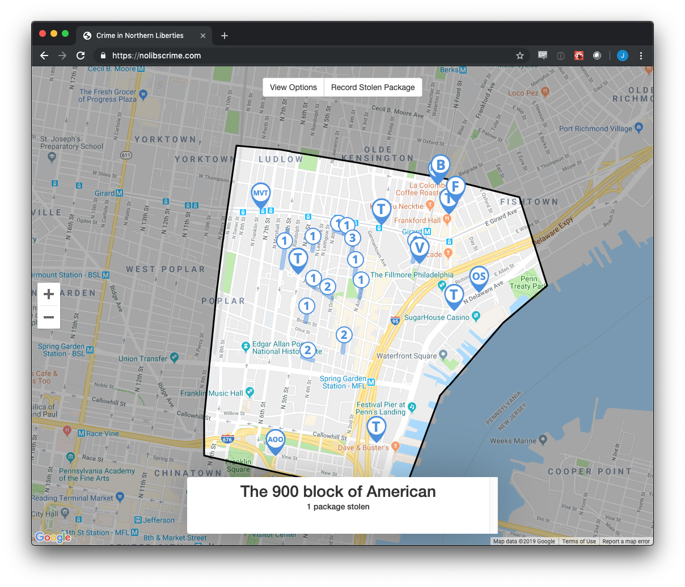

<!-- Main -->

  <section id="one">
    

      <header class="major">
        <h2>Philadelphia, PA Freelance Programmer / Software Developer</h2>
      </header>
      

        I really love Philly. It's a fantastic city. I hope to be able to use my skills to improve the city over time -- here are some of my efforts towards doing so.
      

    

  </section>

  <!-- Two -->
  <section id="two" class="spotlights">
    <section>
      
      

        

          <header class="major">
            <h3>NoLibsCrime.com</h3>
          </header>
          

           Like many cities today, Philadelphia has a problem with stolen packages outside of people's homes. There are a lot of people trying to tackle this problem in different ways -- I built NoLibsCrime.com to crowdsource stolen package information in real time in order to run analyses on the geospatial data. The application is built on React.js & MobX on the frontend and Flask & PostGIS on the backend.
          

          
I love Philadelphia and want to see the city improve for everyone. If you have ideas on how to expand on this project or want to collaborate, reach out: hello@juliusparishy.com

          <ul class="actions">
            <li><a href="https://nolibscrime.com" class="button">NoLibsCrime.com</a></li>
          </ul>
        

      

    </section>
  </section>

  <!-- Three -->
  <section id="three">
    

      <header class="major">
        <h2>Can I build something for you?</h2>
      </header>
      

        If you're a local Philadelphia business I'd love to work with you. I build Apps and Backend APIs on a freelance basis and can even chat in person if you're in the city. Let's caht.
      

      <ul class="actions">
        <li><a href="apps" class="button next">Apps</a></li>
        <li><a href="backend" class="button next">Backend APIs</a></li>
      </ul>
    

  </section>

